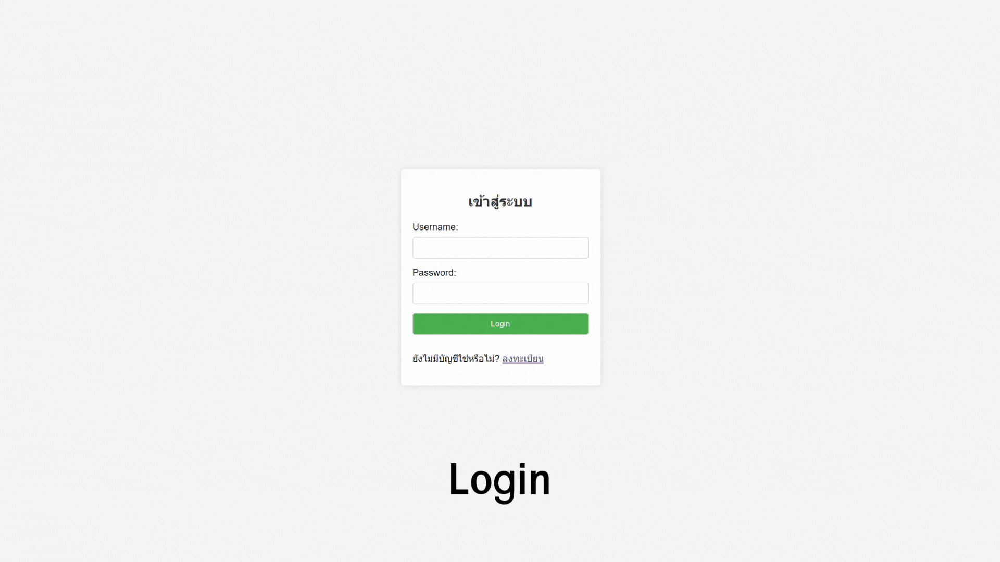

# Web-Blog

Mini Project Java Web Application Development

Collaborated with a team to build a blog platform using Java Spring Boot and MySQL, enabling users to search, post, edit, delete, like, and comment on blog entries, improving content engagement and user interaction.

Tech stack
-----------------
- Java Spring Boot
- phpMyAdmin

Member
-----------------
1.นายยุทธการ วรรณทอง   643020407-8  (profile, dashboard)  
2.นางสาวศศิธร สอนดอก   643020414-1  (create, like, comment)  
3.นางสาวนิภา สินไธสง      643021109-1  (edit, delete)  
4.นางสาวรินรดา บุญมาปัด 643021118-0  (login, register) 
